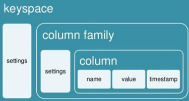

# Preguntas frecuentes (FAQ)

## Que es Apache Cassandra?

Apache cassandra es una base de dades NoSQL, va ser creada per bases de dades amb el fi de gestionar gran volum de dades, 
avui en dia aquest tipus de base de dades ofereixen flexibilitat, escalabilitat i velocitat al navegar entre aquest tipus de dades.

## Quin tipus de SGBD es Apache Cassandra?

És un DBMS no relacional, es de tipus clau-valor, Clau-valor, la base de dada més senzilla i popular. En aquest sistema cada element es troba identificat per una clau única, la qual cosa ens permet obtenir les dades d'una forma molt ràpida que utilitza els següents conceptes:

- `Column`: és el nivell més baix que hi ha, es tracta d'una estructura amb 3 camps, que són: el nom de la columna, el valor que té i el timestamp. El timestamp conté el moment (data, hora en mil·lisegons) en la qual s'ha realitzat la inserció. 
- `Supercolumn`: és un conjunt de Columns. 
- `ColumnFamily`: es tracta d'un conjunt de Columns ordenades, de tal manera que cada fila conté una clau. Les ColumnFamily es poden definir com les taules de les bases de dades relacionals.
- `Keyspace`: és el nivell més alt en el model de dades. La keyspace conté totes les famílies de columnes. Perquè ens resulti més senzill d'entendre, podem comparar-ho amb la base de dades en el model relacional:



## Quins són els requisits del sistema?

Com la majoria de bases de dades, el rendiment de Cassandra millora amb més nuclis de CPU, més RAM i discs més ràpids. 
Tot i que Cassandra es pot fer funcionar en petits servidors per a proves o entorns de desenvolupament (incloent Raspberry Pis), 
un servidor de producció mínim requereix, com a mínim: 

- `2 nuclis` (L'addició de nuclis de CPU addicionals augmenta el rendiment tant de lectures com d'escriptura.)
- `8 GB` de RAM

Cassandra està dissenyat per proporcionar redundància a través de múltiples servidors independents i barats. 
Per tant, els servidors amb múltiples discs sovint se serveixen millor utilitzant `RAID0` o `JBOD` que `RAID1` o `RAID5`.

# Quines versions de Apache Cassandra existeixen?

Datastax Devcenter ofereix una plataforma amb base de dades Apache Cassandra. Hi ha tres versions disponibles: Free, Pay As You Go i Enterprise.

- La versió Free és totalment gratuïta i permet treballar amb la base de dades sense cap límit. No inclou suport ni serveis de manteniment.

- La versió Pay As You Go ofereix un servei on pagues segons l'ús que fas. Aquesta versió et permet escalar la teva base de dades i distribuir els nodes segons les teves necessitats. Si ho desitges, pots actualitzar a la versió Enterprise en qualsevol moment.

- La versió Enterprise inclou tots els beneficis de la versió Pay As You Go i ofereix funcionalitats addicionals. A més de l'escalabilitat i la distribució de nodes, aquesta versió proporciona controls de salut per als teus servidors i serveis, optimització avançada, descomptes per volums i accés a un enginyer professional amb un temps de resposta màxim de 15 minuts.

- En resum, Datastax Devcenter ofereix una plataforma flexible per treballar amb Apache Cassandra, amb opcions gratuïtes i de pagament que permeten adaptar-se a les necessitats de cada projecte.

## Quines són les instruccions per arrancar / verificar status / apagar servei de la base de dades?

Per arrancar cassandra:
- `sudo service cassandra start`

Per verificar status:
- `nodetool status` o `service cassandra status`

Per apagar servei:
- `sudo service cassandra stop` o `nodetool stopdaemon`

## A on es troba i quin nom rep el fitxer de configuració?

Es pot trobar al següent directori:
- `/etc/cassandra/cassandra.yaml`

## Com puc veure a quins directoris estan tots els arxius o configuracions de cassandra?
- Es poden veure amb varies comandes que venen en linux definides, com per exemple `whereis` / `find`:
```
sudo whereis cassandra
``` 
o també amb 
```
sudo find . -name cassandra -print
```
## A on es troben físicament els fitxers de dades (per defecte)?

- `/var/lib/cassandra/data/<db_name>/`

## En quins ports escolta Apache Cassandra?

Per defecte, Cassandra utilitza el port 7000 per a la comunicació amb el clúster (7001 si SSL està habilitat).
El port 9042 per als clients de protocol natiu, i 7199 per a JMX. 
Tots els ports són TCP.


## Quina modificació/passos caldrien fer per canviar aquests ports a uns altres?

Els ports de comunicació internode i de protocol natiu són configurables en cassandra-yaml. 
El port JMX és configurable en cassandra-env.sh (a través de les opcions JVM).
