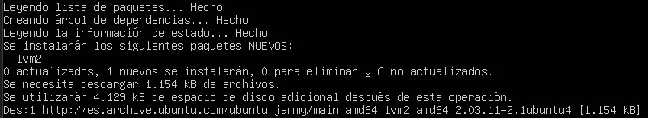

# Configuració de LVM en Cassandra

## Instal·lació del paquet per poder fer volums logics

1. Instal·lació el paquet lvm2
```
sudo apt-get install lvm2
```
> Output
 

2. Creació del volum fisic

```
pvcreate /dev/<nom del volum>
```

3. Creació d'un grup de volums

```
vgcreate <nombr del grupo> /dev/<nomb del volumen>
```

4. Creació del volum lògic

```
lvcreate -n <nom del volum> -L <quantitat d'espai> [exemple: 10G] <nom del grup>
```

5. Formateig del volum lògic
```
sudo mkfs.ext4 /dev/<nom del grup>/<nom del volum logic> /mnt/<nom del volum logic>
```

## Us del volum lògic amb Apache Cassandra

6. Configuració de Cassandra per usar el LVM

```
sudo nano /etc/cassandra/cassandra.yaml

data_file_directories:
  -  /mnt/<nom del volum logic>
```

7. Reinici del servei Cassandra

```
sudo systemctl restart cassandra.service
```