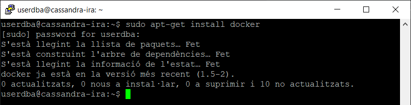
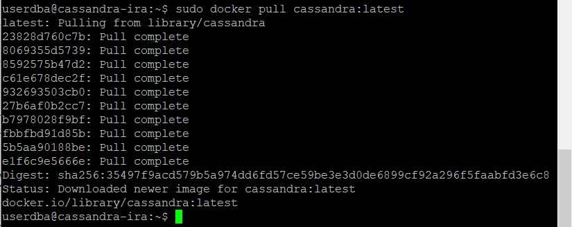
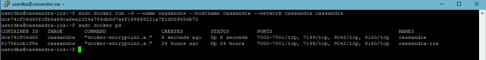
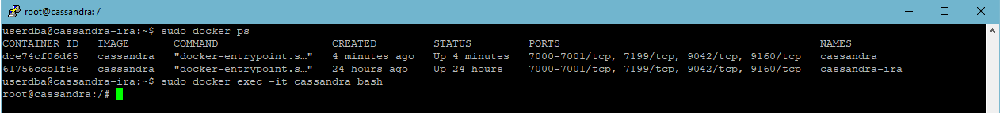

# Instal·lació de Apache Cassandra amb Docker (Linux version Ubuntu 22.04 LTS) 
## Autor: Rohit Kumar Kumar, Ismael Flor Blas i Alejandro Pérez Pretel

# Instal·lació de Docker

## Configuracions prèvies

1. Abans de tot hem de tenir la configuració de IP estàtica i configuració del dns_server
- A addresses pots posar qualsevol ip que estigui al rang de la teva xarxa
```
# This is the network config written by 'subiquity'
network:
  ethernets:
    enp0s3:
      dhcp4: false
      addresses: [192.168.1.200/24]
      gateway4: 192.168.1.1
      nameservers:
        addresses: [192.168.1.1,8.8.8.8]

  version: 2

```
2. Actualitzar els paquets en Ubuntu
- Per actualitzar els paquets executa la següent coamnda en consola:
```
sudo apt-get update && sudo apt upgrade
```
## Instal·lacio de Cassandra

1. Per instal·lar [Docker](https://www.docker.com), hem d'executar la següent comanda en consola:
```
sudo apt-get install docker
```
> Output

 

2. Instal·lem la imatge de cassandra
```
sudo docker pull cassandra:latest
``` 
> Output

 

3. Creem una nova xarxa Cassandra
```
sudo docker network create <nom_xarxa>
``` 
> Output

 

4. Creació d'una instància de cassandra per poder accedir a la base de dades:
```
sudo docker run -d --name cassandra --hostname cassandra --network <nom_xarxa> cassandra
``` 
> Output

 

5. Creació d'una instància de cassandra per poder accedir a la base de dades:
```
sudo docker exec -it <docker_name>
``` 
> Output

 


# Configuració de  Apache Cassandra

Per configurar Cassandra utilitzant la comanda `sudo docker exec -it cassandra`, segueix els passos següents:

## Abans d'Utilitzar Cassandra s'han de fer alguns canvis a la configuració de Cassandra 

1. Primerament mirem si el servei Cassandra està actiu o no amb la comanda `nodetool status`
> Output


1. Executa la comanda `sudo docker exec -it cassandra cqlsh` per accedir a l'interfície de línia de comandes de Cassandra.

2. Un cop dins de l'interfície de línia de comandes de Cassandra, pots executar les comandes CQL per configurar la base de dades segons les teves necessitats.

3. Per exemple, pots crear un espai de claus (keyspace) utilitzant la comanda `CREATE KEYSPACE` i especificant els paràmetres necessaris com el nom i la replicació.

4. Després de crear l'espai de claus, pots crear taules utilitzant la comanda `CREATE TABLE` i especificant els camps i les seves propietats.

5. També pots inserir dades a les taules utilitzant la comanda `INSERT INTO`.

6. Un cop hagis configurat la base de dades segons les teves necessitats, pots sortir de l'interfície de línia de comandes de Cassandra utilitzant la comanda `exit`.

Això és tot! Ara ja hauràs configurat Cassandra utilitzant la comanda `sudo docker exec -it cassandra`.

