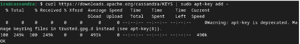

# Instal·lació de Apache Cassandra en local (Linux version Debian 11) 
## Autor: Rohit Kumar Kumar, Ismael Flor Blas i Alejandro Pérez Pretel

# Instal·lació en Local

## Configuracions prèvies

1. Abans de tot hem de tenir la configuració de IP estàtica i configuració del dns_server
- A addresses pots posar qualsevol ip que estigui al rang de la teva xarxa
```
# This is the network config written by 'subiquity'
network:
  ethernets:
    enp0s3:
      dhcp4: false
      addresses: [192.168.1.200/24]
      gateway4: 192.168.1.1
      nameservers:
        addresses: [192.168.1.1,8.8.8.8]

  version: 2

```
2. Actualitzar els paquets en Ubuntu
- Per actualitzar els paquets executa la següent coamnda en consola:
```
sudo apt-get update && sudo apt upgrade
```
## Instal·lacio de Cassandra

1. Per instal·lar Cassandra via local tindrem que afegir en un arxiu .list on es troba el paquet
```
echo "deb https://debian.cassandra.apache.org 41x main" | sudo tee -a /etc/cassandra.sources.list
```

2. Afegim i obtenim la clau per utilitzar Apache Cassandra
```
curl https://downloads.apache.org/cassandra/KEYS | sudp apt-key add -
```
> Output

 

3. Fem "upgrade" als paquets
```
sudo apt-get upgrade
``` 

4. Creació d'una instància de cassandra per poder accedir a la base de dades
```
sudo apt-key adv --keyserver pool.sks-keyservers.net --recv-key A278B781FE4B2BDA
``` 
> Output


5. Instal·lem el paquet Cassandra
```
sudo apt-get install cassandra
``` 
> Output


6. Inicialització del servei Cassandra
```
sudo systemctl start cassandra.service
``` 

7. Comprovació del servei
```
sudo systemctl status cassandra.service
```
> Output


# Configuració de  Apache Cassandra

Per configurar Cassandra utilitzant la comanda `sudo docker exec -it cassandra`, segueix els passos següents:

## Abans d'Utilitzar Cassandra s'han de fer alguns canvis a la configuració de Cassandra 

1. Primerament mirem si el servei Cassandra està actiu o no amb la comanda `systemctl status cassandra.service`
> Output


`UN` Significa que és UP Normal(Funcionant).

2. Uns dels parèmetres que hem de configurar són la IP o IPs que escoltará el servidor, en aquest cas `192.168.1.200`, anomenat com `listen_address`:
>Output
  

3. Juntament amb el seu port interfície que surtirá a internet
>Output


## Configuració Bàsica per accedir i Utilitzar Cassandra

1. Executa la comanda `sudo cqlsh` per accedir a l'interfície de línia de comandes de Cassandra.

2. Un cop dins de l'interfície de línia de comandes de Cassandra, pots executar les comandes CQL per configurar la base de dades segons les teves necessitats.

3. Per exemple, pots crear un espai de claus (keyspace) utilitzant la comanda `CREATE KEYSPACE` i especificant els paràmetres necessaris com el nom i la replicació.

4. Després de crear l'espai de claus, pots crear taules utilitzant la comanda `CREATE TABLE` i especificant els camps i les seves propietats.

5. També pots inserir dades a les taules utilitzant la comanda `INSERT INTO`.

6. Un cop hagis configurat la base de dades segons les teves necessitats, pots sortir de l'interfície de línia de comandes de Cassandra utilitzant la comanda `exit`.

Això és tot! Ara ja hauràs configurat Cassandra utilitzant la comanda `cqlsh`.
