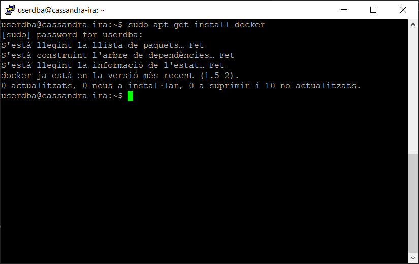

# Instal·lació de Apache Cassandra amb Docker (Linux version Ubuntu 22.04 LTS) 
## Autor: Rohit Kumar Kumar, Ismael Flor Blas i Alejandro Pérez Pretel

# Instal·lació de Docker

## Configuracions prèvies

1. Abans de tot hem de tenir la configuració de IP estàtica i configuració del dns_server
- A addresses pots posar qualsevol ip que estigui al rang de la teva xarxa
```
# This is the network config written by 'subiquity'
network:
  ethernets:
    enp0s3:
      dhcp4: false
      addresses: [192.168.1.200/24]
      gateway4: 192.168.1.1
      nameservers:
        addresses: [192.168.1.1,8.8.8.8]

  version: 2

```
2. Actualitzar els paquets en Ubuntu
- Per actualitzar els paquets executa la següent coamnda en consola:
```
sudo apt-get update && sudo apt upgrade
```
## Instal·lacio de Docker

1. Per instal·lar [Docker](https://www.docker.com), hem d'executar la següent comanda en consola:
```
sudo apt-get install docker
```
> Output

 

2. Per instal·lar [Docker](https://www.docker.com), hem d'executar la següent comanda en consola:
```
sudo apt-get install docker
``` 

